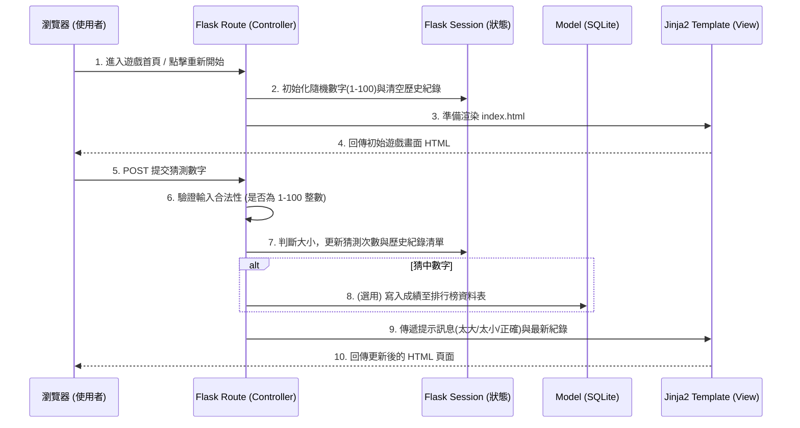

# 系統架構設計 - 猜數字遊戲系統

## 1. 技術架構說明
- **選用技術與原因**：
  - **後端 (Python + Flask)**：Flask 是一個輕量級且靈活的 Web 框架，適合這種小型專案快速開發，可以輕鬆管理路由與使用者的遊戲狀態 (Session)。
  - **前端 (Jinja2)**：與 Flask 緊密整合的模板引擎，能在伺服器端直接渲染 HTML 並套用後端變數，開發效率高，無需前後端分離即可實作完整的介面。
  - **資料庫 (SQLite)**：輕量、內建於 Python、無須額外設定伺服器。雖然核心遊戲不依賴資料庫，但非常適合用來記錄歷史最佳成績與排行榜 (Nice to Have)。
- **Flask MVC 模式說明**：
  - **Model (模型)**：負責定義資料庫的資料結構與互動邏輯（例如儲存玩家的最少猜測次數與排行榜資料）。
  - **View (視圖)**：Jinja2 模板，負責介面呈現（HTML/CSS），負責顯示輸入框、遊戲提示與歷史紀錄。
  - **Controller (控制器)**：Flask 的路由函式 (Routes)，負責接收使用者的表單輸入、驗證合法性、處理遊戲邏輯（判斷太大或太小），並將處理結果與變數傳遞給 View 進行渲染。

## 2. 專案資料夾結構

採用適合中小型 Flask 專案的目錄結構，確保職責分離與未來可擴充性。

```text
web_app_development2/
├── app/
│   ├── __init__.py      ← 初始化 Flask 應用程式的工廠函式 (App Factory)
│   ├── models/          ← 資料庫模型 (例如定義 Leaderboard 資料表)
│   │   └── leaderboard.py
│   ├── routes/          ← Flask 路由 (Controller)，包含首頁與遊戲核心邏輯
│   │   └── game.py
│   ├── templates/       ← Jinja2 HTML 模板 (View)
│   │   ├── base.html    ← 共用網頁版型 (包含 Header/Footer 與基礎 CSS 引入)
│   │   └── index.html   ← 遊戲主畫面 (輸入框與結果提示)
│   └── static/          ← 靜態資源檔案
│       ├── css/
│       │   └── style.css
│       └── js/
│           └── script.js
├── instance/
│   └── database.db      ← SQLite 資料庫檔案 (系統執行時自動產生)
├── docs/                ← 專案設計文件
│   ├── PRD.md
│   └── ARCHITECTURE.md
├── .env                 ← 環境變數 (如 FLASK_APP, FLASK_SECRET_KEY 等敏感資訊)
├── requirements.txt     ← Python 依賴套件清單
└── run.py               ← 專案入口點，負責啟動測試伺服器
```

## 3. 元件關係圖

以下展示使用者互動時，系統各元件的資料流關係：



## 4. 關鍵設計決策

1. **使用 Session 管理遊戲狀態**：
   - **原因**：為了確保每個使用者的遊戲過程（包含正確答案、猜測次數、歷史紀錄）彼此獨立，將這些狀態加密儲存在使用者的 Session (Cookie) 中。這樣能避免在伺服器端維護複雜的使用者對應表，也無須強制使用者登入才能遊玩。
2. **伺服器端渲染 (SSR)**：
   - **原因**：為了快速交付 MVP 並降低開發複雜度，直接使用 Jinja2 渲染完整的 HTML 頁面。遊戲邏輯（正確答案的判斷）皆放在後端處理，能避免玩家透過瀏覽器開發者工具查看 JavaScript 變數而作弊。
3. **輕量化資料庫 (SQLite)**：
   - **原因**：MVP 的主要遊戲邏輯完全不依賴資料庫，資料庫僅用於未來實作「排行榜」功能。SQLite 可以將資料儲存於本地檔案，免去架設 MySQL/PostgreSQL 的麻煩，簡化了開發與部署。
4. **模組化的資料夾結構**：
   - **原因**：雖然猜數字是個小專案，但一開始就採用 `app/routes` 與 `app/models` 的結構設計。當未來要擴充難度選擇、新增其他小遊戲，或是與資料庫深度整合時，能更容易維護程式碼。
