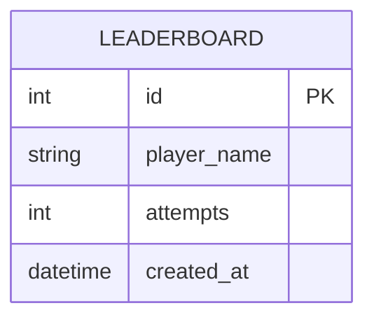

# 資料庫設計 - 猜數字遊戲系統

本文件基於 PRD 與系統架構設計，定義本專案所需的 SQLite 資料表結構。由於遊戲核心邏輯依賴 Session 狀態管理，因此資料庫的主要用途為實作「歷史最佳成績排行榜」。

## 1. ER 圖（實體關係圖）

## 2. 資料表詳細說明

### `leaderboard` (排行榜資料表)

用於記錄玩家成功猜中數字的最佳成績（以最少猜測次數優先排名）。

| 欄位名稱 | 說明 | 型別 | 是否必填 | 備註 |
| --- | --- | --- | --- | --- |
| `id` | 唯一識別碼 | INTEGER | 是 | PRIMARY KEY, AUTOINCREMENT |
| `player_name` | 玩家名稱 | TEXT | 是 | 供顯示於排行榜上 |
| `attempts` | 猜測次數 | INTEGER | 是 | 記錄該局總共猜了幾次 |
| `created_at` | 建立時間 | DATETIME | 是 | 預設為 CURRENT_TIMESTAMP |

## 3. SQL 建表語法

完整的 CREATE TABLE 語法已儲存於 `database/schema.sql` 中。

## 4. Python Model 程式碼

針對 Leaderboard 資料表封裝的 CRUD 邏輯（採用 `sqlite3` 實作），已儲存於 `app/models/leaderboard.py` 中。
