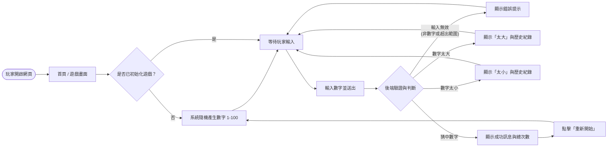
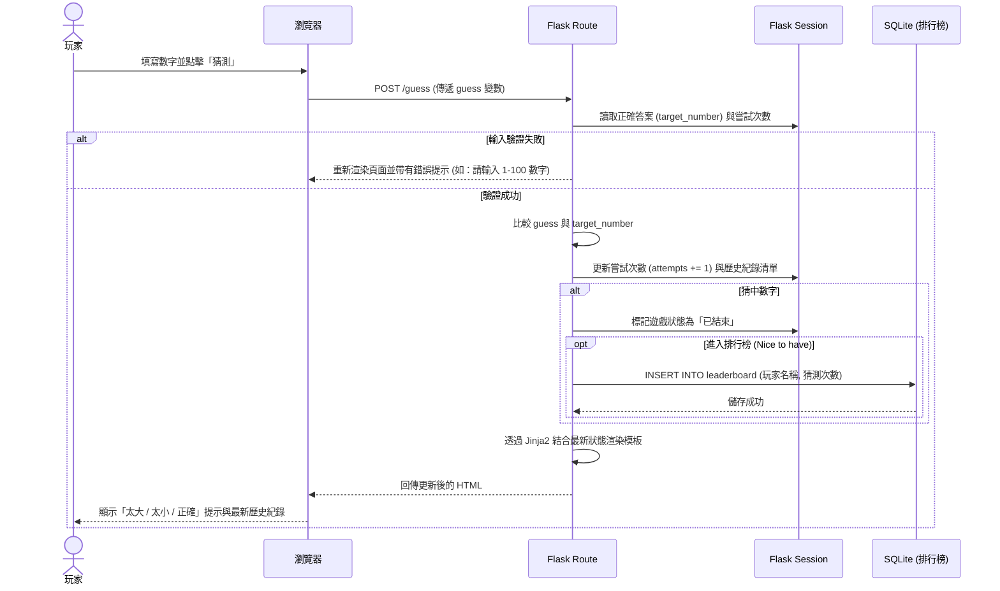

# 流程圖設計 - 猜數字遊戲系統

本文件根據 PRD 與系統架構設計，視覺化使用者的操作路徑與系統內的資料傳遞流程。

## 1. 使用者流程圖（User Flow）

描述玩家從進入遊戲到完成一局遊戲的完整路徑。

## 2. 系統序列圖（Sequence Diagram）

以下描述「玩家送出猜測數字」到「畫面更新結果」的完整資料流互動。

## 3. 功能清單對照表

列出目前系統主要功能的 URL 路由對應設計，供後續 API (`/api-design`) 與路由實作參考。

| 功能名稱 | URL 路徑 | HTTP 方法 | 說明 |
| --- | --- | --- | --- |
| **進入遊戲首頁** | `/` | `GET` | 顯示主畫面。若 Session 無進行中狀態，則自動初始化隨機數字。 |
| **提交猜測數字** | `/guess` | `POST` | 接收表單傳來的數字，判斷大小並更新 Session，最後渲染回首頁。 |
| **重新開始遊戲** | `/restart` | `POST` | 清除 Session 中的當局遊戲狀態，並重導向回 `/` 開啟新局。 |
| **(選用) 最佳成績排行榜**| `/leaderboard` | `GET` | 從 SQLite 讀取前 10 名最佳成績並顯示。 |
